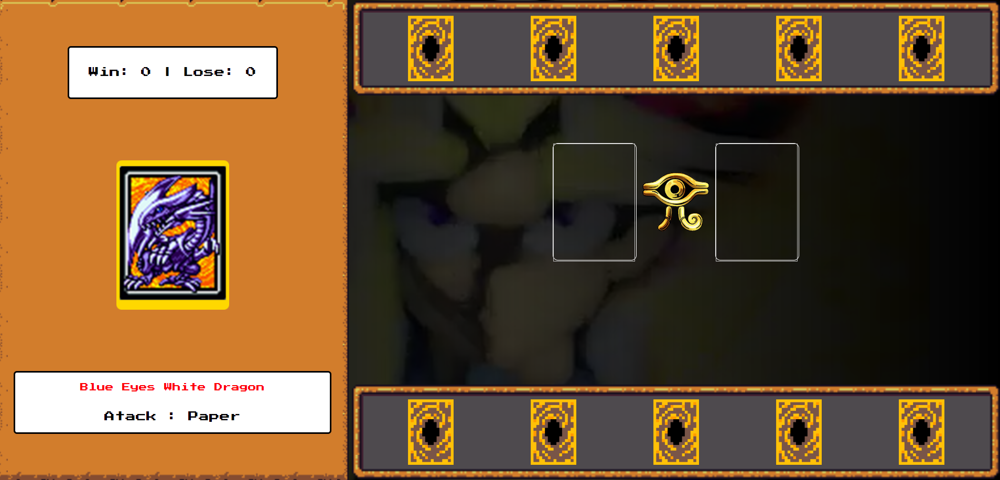

# Game-Yu-Gi-Oh - DIO

Seja Bem-Vindo ao duelo de Yu-Gi-Oh, onde você pode batalhar e se divertir !
Para jogar você deve escolher uma das 5 cartas que foram sortiadas para você onde o atack pode ser (Pedra, Papel ou tesoura) e o seu inimigo é o computador.

BORA VENCER !
 

# **📈 OBJETIVO:**
### 📚 Aprendizado
### 🧠 Conhecimento
### ⭐ Sucesso
 

# **🛠 LINGUAGENS UTILIZADAS:**

  

